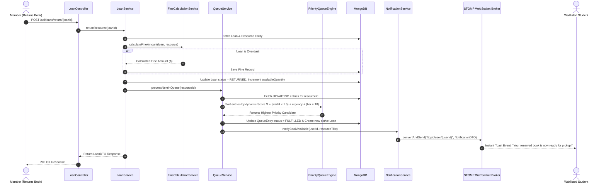

# LIBRARIX — System Architecture & Viva/Interview Reference Guide

This document is an exhaustive technical reference on the system architecture, component wiring, data flows, and Spring Boot 3 / Java 21 engineering patterns implemented in **LIBRARIX**.

---

## 1. High-Level System Architecture

LIBRARIX follows a clean **3-Tier Layered Architecture** with strict Separation of Concerns. No business or data access logic leaks into controllers, and database entities are decoupled from HTTP API DTO contracts.

```mermaid
graph TB
    subgraph ClientLayer["Client Layer (Next.js 14 + React 18)"]
        UI[Web Application Pages]
        WS_CLIENT[SockJS + STOMP Client]
        AI_UI[LIBRA-AI Assistant Modal]
    end

    subgraph SecurityLayer["Security & Gateway Layer"]
        JWT_FILTER[JwtAuthenticationFilter]
        RL_INTERCEPTOR[RateLimitInterceptor - Sliding Window]
    end

    subgraph ControllerLayer["Controller Layer (REST Endpoints)"]
        AUTH_CTRL[AuthController]
        RES_CTRL[ResourceController]
        LOAN_CTRL[LoanController]
        QUEUE_CTRL[QueueController]
        FINE_CTRL[FineController]
        AI_CTRL[AiController]
    end

    subgraph ServiceLayer["Service & Business Logic Layer"]
        AUTH_SVC[AuthService]
        RES_SVC[ResourceService]
        LOAN_SVC[LoanService]
        QUEUE_SVC[QueueService]
        FINE_SVC[FineCalculationService]
        NOTIF_SVC[NotificationService]
    end

    subgraph AlgoLayer["Production Algorithmic Engines"]
        TRIE[TrieAutocompleteEngine - O(p+k)]
        BLOOM[BorrowBloomFilter - FNV-1a BitSet]
        SEGTREE[AvailabilitySegmentTree - Range Tree]
        DIJKSTRA[LibraryRouteOptimizer - Shortest Path]
        WFQ[PriorityQueueEngine - Weighted Fair Queue]
        LRUK[LruKCacheService - K=2 Eviction]
        GRAPH[CoBorrowGraphService - LPA Clustering]
    end

    subgraph DataLayer["Persistence & Messaging"]
        REPO[Spring Data MongoDB Repositories]
        MONGO[(MongoDB 7.0 Document Database)]
        STOMP[Spring STOMP WebSocket Message Broker]
    end

    UI --> RL_INTERCEPTOR --> JWT_FILTER
    JWT_FILTER --> AUTH_CTRL & RES_CTRL & LOAN_CTRL & QUEUE_CTRL & FINE_CTRL & AI_CTRL
    WS_CLIENT --> STOMP

    RES_CTRL --> RES_SVC --> TRIE & SEGTREE & DIJKSTRA
    LOAN_CTRL --> LOAN_SVC --> BLOOM & FINE_SVC & NOTIF_SVC
    QUEUE_CTRL --> QUEUE_SVC --> WFQ
    RES_SVC --> LRUK
    AI_CTRL --> GRAPH

    LOAN_SVC & QUEUE_SVC & RES_SVC --> REPO --> MONGO
    NOTIF_SVC --> STOMP
```

---

## 2. Layered Architecture Principles & Guardrails

1. **Controller Layer (`com.librarix.controller`)**:
   - Accepts HTTP requests, validates DTO inputs via Spring `@Valid`, delegates execution to services, and returns standardized `ResponseEntity<T>` DTOs.
   - **Guardrail**: Controllers *never* inject repository interfaces directly and *never* expose database entities (`@Document`).

2. **Service Layer (`com.librarix.service` & `algorithm`)**:
   - Encapsulates domain logic, priority scoring, cache eviction checks, fine calculations, and transactional boundaries.
   - Converts MongoDB model entities into external DTO payloads.

3. **Repository Layer (`com.librarix.repository`)**:
   - Extends `MongoRepository<T, String>` for database access. Handles atomic operations and query projections.

4. **Security Layer (`com.librarix.security` & `ratelimit`)**:
   - Enforces stateless authentication via JWT Bearer tokens and applies sliding-window rate limiting interceptors.

---

## 3. End-to-End Data Flow: Book Return → Waitlist Pop → WebSocket Alert



---

## 4. Spring Boot 3 & Java 21 Technical Annotations Reference

This table serves as a quick viva/interview reference for Spring concepts used in LIBRARIX:

| Annotation / Concept | Class Location | Purpose & Mechanics |
|:---|:---|:---|
| `@SpringBootApplication` | [`LibrarixApplication.java`](file:///e:/LIBRARIX/backend/src/main/java/com/librarix/LibrarixApplication.java) | Composite annotation of `@Configuration`, `@EnableAutoConfiguration`, and `@ComponentScan`. Entry point. |
| `@RestController` | Controllers | Combines `@Controller` and `@ResponseBody`. Automatically serializes Java return objects to JSON payloads. |
| `@Service` | Services | Marks class as a Spring-managed service singleton bean in the ApplicationContext. |
| `@Repository` | Repositories | Marks interface for Spring Data component scanning and automatic exception translation. |
| `@Configuration` | Configs | Declares class as a source of Spring `@Bean` definitions. |
| `@Document` | Models | Maps Java entity classes to MongoDB collections (e.g., `@Document(collection = "resources")`). |
| `@Id`, `@Version` | Models | `@Id` marks document primary key; `@Version` activates MongoDB Optimistic Locking. |
| `@Indexed(unique=true)` | [`User.java`](file:///e:/LIBRARIX/backend/src/main/java/com/librarix/model/User.java) | Directs MongoDB to create a unique database index on fields like `email` and `barcode`. |
| `@Valid` | Controllers | Triggers JSR-380 Bean Validation on incoming request DTO bodies before controller execution. |
| `@PreAuthorize` | Controllers | Enforces method-level security via SpEL (e.g., `@PreAuthorize("hasRole('ADMIN')")`). |
| `@EnableWebSocketMessageBroker` | [`WebSocketConfig.java`](file:///e:/LIBRARIX/backend/src/main/java/com/librarix/config/WebSocketConfig.java) | Enables STOMP message broker processing over WebSockets. |
| `@RestControllerAdvice` | [`GlobalExceptionHandler.java`](file:///e:/LIBRARIX/backend/src/main/java/com/librarix/exception/GlobalExceptionHandler.java) | Intercepts exceptions thrown across all REST controllers and maps them to clean `ApiErrorResponse` JSON. |
| **Constructor Injection** | All Classes | Applied via Lombok `@RequiredArgsConstructor`. Guarantees thread safety and immutability via `final` fields. |

---

## 5. Security & Persistence Architecture

1. **Stateless JWT Authentication**:
   - Auth requests exchange credentials for a signed HMAC-SHA512 JWT token containing user ID, role, and expiration.
   - [`JwtAuthenticationFilter.java`](file:///e:/LIBRARIX/backend/src/main/java/com/librarix/security/JwtAuthenticationFilter.java) validates the token on every incoming request and populates the Spring `SecurityContextHolder`.

2. **MongoDB Database Persistence**:
   - Stores documents in 6 collections: `users`, `resources`, `loans`, `reservation_queues`, `fines`, `notifications`.
   - Uses Optimistic Locking (`@Version`) to prevent race conditions during concurrent book checkout attempts.

3. **Real-Time WebSockets (STOMP)**:
   - Configured with SockJS fallback (`/ws-librarix`).
   - Clients subscribe to `/topic/user/{userId}` to receive instant push alerts without polling.
