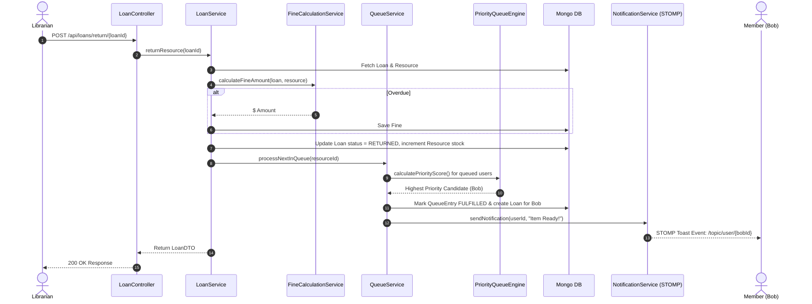

# LIBRARIX Architecture & Spring Boot 3 Viva Cheat-Sheet

This document serves as an exhaustive reference guide to the architectural patterns, Spring Boot 3 concepts, and design decisions implemented in **LIBRARIX**. It is designed for viva examination and technical interview preparation.

---

## 1. 3-Tier Layered Architecture

LIBRARIX strictly enforces a **3-Tier Separation of Concerns**:

```
[ HTTP REST / STOMP WebSockets ]
             │
             ▼
[ Controller Layer (com.librarix.controller) ]
             │  (DTOs only, no Repositories)
             ▼
[ Service Layer (com.librarix.service & algorithm) ]
             │  (Business rules, score calculations, transactional boundaries)
             ▼
[ Repository Layer (com.librarix.repository) ]
             │  (Spring Data Mongo Repository interfaces)
             ▼
[ Database Layer (MongoDB) ]
```

### Architectural Guardrails Enforced:
1. **Controllers never call Repositories directly**: All database queries and operations flow through the Service layer.
2. **Entities are never exposed to HTTP clients**: Entities (`@Document`) represent database schema layout; DTOs represent API contract shape. Mappers convert entities to DTOs.
3. **Stateless Security**: No HTTP session storage (`SessionCreationPolicy.STATELESS`). Requests carry a cryptographic JWT header.

---

## 2. Spring Boot Annotations & Concept Index

| Annotation / Concept | Location in Code | Core Purpose & Explanation |
| :--- | :--- | :--- |
| `@SpringBootApplication` | [LibrarixApplication.java](file:///e:/LIBRARIX/backend/src/main/java/com/librarix/LibrarixApplication.java) | Composite annotation combining `@Configuration`, `@EnableAutoConfiguration`, and `@ComponentScan`. |
| `@RestController` | Controllers | Combines `@Controller` and `@ResponseBody`. Automatically serializes returned Java objects to JSON. |
| `@Service` | Services | Marks class as a Spring-managed service bean containing business logic. |
| `@Repository` | Repositories | Marks interface for Spring Data component scanning and exception translation. |
| `@Configuration` | Config classes | Indicates class provides Spring `@Bean` definitions. |
| `@Document(collection = "...")` | Models | Specifies MongoDB document collection mapping for Spring Data MongoDB. |
| `@Id`, `@Version` | Models | `@Id` marks primary key; `@Version` provides Optimistic Locking concurrency protection. |
| `@Indexed(unique = true)` | [User.java](file:///e:/LIBRARIX/backend/src/main/java/com/librarix/model/User.java) | Directs Mongo to construct a unique index on fields like `email` and `barcode`. |
| `@Valid` | Controllers | Triggers Bean Validation (`spring-boot-starter-validation`) on DTO fields before method execution. |
| `@PreAuthorize` | Controllers | Method-level security check evaluating SpEL expressions like `hasAnyRole('ROLE_LIBRARIAN')`. |
| `@EnableWebSocketMessageBroker` | [WebSocketConfig.java](file:///e:/LIBRARIX/backend/src/main/java/com/librarix/config/WebSocketConfig.java) | Enables STOMP message broker processing over WebSockets. |
| `@RestControllerAdvice` | [GlobalExceptionHandler.java](file:///e:/LIBRARIX/backend/src/main/java/com/librarix/exception/GlobalExceptionHandler.java) | Global exception interceptor catching exceptions thrown by any `@RequestMapping` controller. |
| Constructor Injection | All Services/Controllers | Managed via Lombok `@RequiredArgsConstructor`. Ensures immutability (`final` fields) and testability without magic field injection. |

---

## 3. Data Flow & Core Mechanic (Return -> Queue -> WebSocket)


