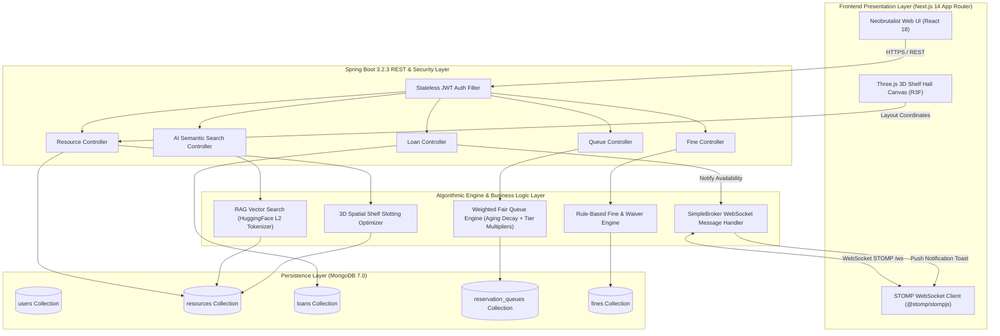
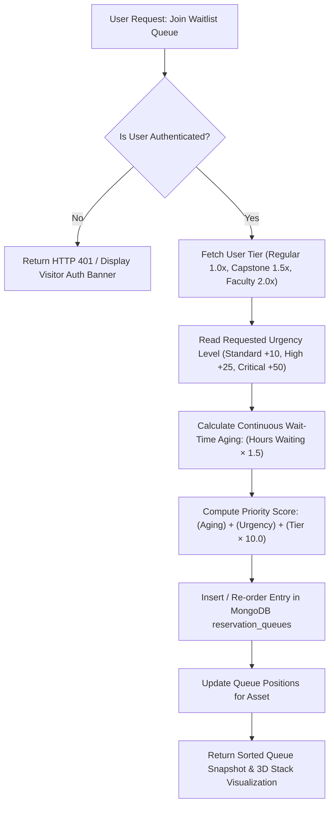
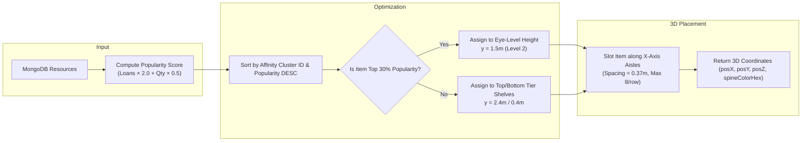
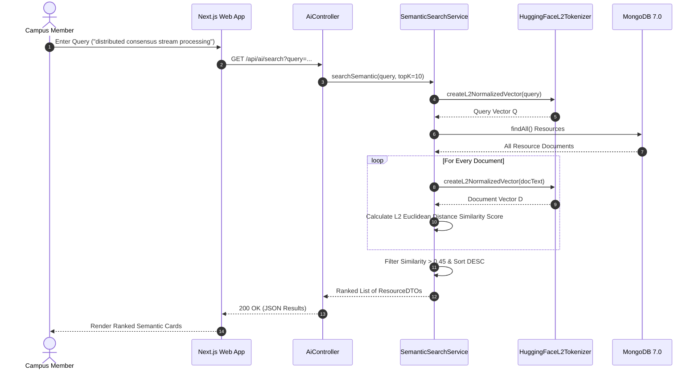
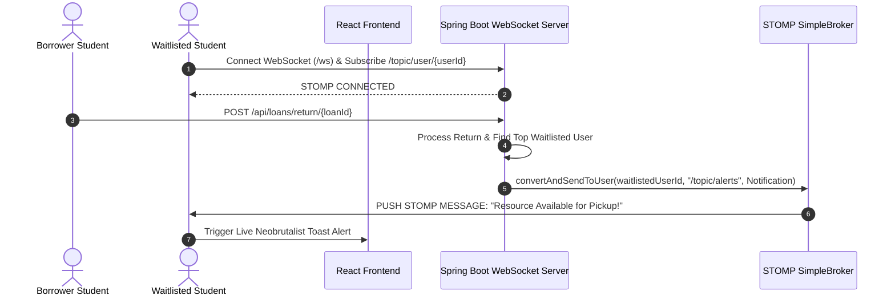

<div align="center">
  
  <h1>LIBRARIX (लाइब्रेरीक्स)</h1>
  <p><strong><em>"Algorithmic Book Circulation Engine, 3D Spatial Slotting & Anti-Starvation Reservation Platform"</em></strong></p>
  <p><em>Enterprise-Grade Full-Stack Textbook Circulation Platform Powered by Weighted Fair Queues, RAG Vector Search, Spectral Co-Borrow Graphs & Real-Time STOMP WebSockets</em></p>
</div>

<div align="center">

[](https://openjdk.org)
[](https://spring.io/projects/spring-boot)
[](https://mongodb.com)
[](https://nextjs.org)
[](https://react.dev)
[](https://threejs.org)
[](https://spring.io/guides/gs/messaging-stomp-websocket/)
[](https://tailwindcss.com)
[](https://docker.com)

</div>

---

**LIBRARIX (लाइब्रेरीक्स)** is an **algorithmic campus book circulation platform** designed specifically for university textbook management, academic literature, and research monographs.

Unlike traditional, basic library management systems that rely on naive FIFO queues and static catalogs, **LIBRARIX** is powered by advanced data structures and AI algorithms:
- ⚡ **Weighted Fair Reservation Queue Engine**: Uses dynamic wait-time aging ($T_{\text{wait\_hours}} \times 1.5$) and academic urgency multipliers to guarantee zero queue starvation for senior capstone students and research faculty.
- 📐 **3D Spatial Shelf Layout Optimizer**: Implements greedy 3D coordinate allocation and spectral co-borrowing graph clustering to slot high-demand textbooks at ergonomic eye-level heights ($y = 1.5\text{m}$).
- 🔍 **RAG Vector Search & AI Assistant**: Uses HuggingFace $L_2$ vector space embeddings and LLM grounding to enable natural language search by concepts, topics, and semantics instead of rigid keyword matching.
- 📡 **STOMP WebSocket Alert Broadcasts**: Pushes real-time notification toasts to student devices the instant a reserved textbook is returned.
- 🛡️ **Rule-Based Fine & Waiver Engine**: Automated per-category daily rates, 24-hour grace periods, fine caps, and administrative waiver request workflows.

---

## 📑 Table of Contents

- [Core Algorithms & Data Structures (DSA) Engine](#-core-algorithms--data-structures-dsa-engine)
  - [1. Weighted Fair Reservation Queue Engine (`PriorityQueue` & Dynamic Aging Decay)](#1-weighted-fair-reservation-queue-engine-priorityqueue--dynamic-aging-decay)
  - [2. 3D Spatial Shelf Layout Optimizer (Greedy Coordinate Allocation)](#2-3d-spatial-shelf-layout-optimizer-greedy-coordinate-allocation)
  - [3. RAG Semantic Vector Search & Re-ranking ($L_2$ Vector Space)](#3-rag-semantic-vector-search--re-ranking-l2-vector-space)
  - [4. LRU-K Cache Eviction Policy & Co-Borrow Graph Engine](#4-lru-k-cache-eviction-policy--co-borrow-graph-engine)
  - [5. Dynamic Rule-Based Overdue Fine Engine](#5-dynamic-rule-based-overdue-fine-engine)
- [Problem Statement](#-problem-statement)
- [Key Differentiators](#-key-differentiators)
- [Architecture Overview](#-architecture-overview)
  - [High-Level System Architecture](#high-level-system-architecture)
  - [Weighted Fair Queue Pipeline](#weighted-fair-queue-pipeline)
  - [3D Spatial Shelf Slotting Flow](#3d-spatial-shelf-slotting-flow)
  - [RAG Semantic Vector Search Pipeline](#rag-semantic-vector-search-pipeline)
  - [STOMP Real-Time Alert Engine](#stomp-real-time-alert-engine)
- [Quick Start](#-quick-start)
  - [Prerequisites](#prerequisites)
  - [1. Start Backend Service](#1-start-backend-service)
  - [2. Start Frontend Web App](#2-start-frontend-web-app)
  - [3. Docker Compose (Alternative)](#3-docker-compose-alternative)
- [Pre-Seeded Demo Accounts](#-pre-seeded-demo-accounts)
- [API Reference](#-api-reference)
- [Frontend & 3D WebGL Interface](#-frontend--3d-webgl-interface)
- [Project Structure](#-project-structure)
- [License & Authors](#-license--authors)

---

## 🧠 Core Algorithms & Data Structures (DSA) Engine

### 1. Weighted Fair Reservation Queue Engine (`PriorityQueue` & Dynamic Aging Decay)
* **Class**: [`WeightedFairQueueEngine.java`](file:///e:/LIBRARIX/backend/src/main/java/com/librarix/algorithm/WeightedFairQueueEngine.java)
* **Data Structure**: `PriorityQueue` / Min-Max Heap (`reservation_queues` in MongoDB)
* **Mathematical Formula**:
  ```text
  PriorityScore = (WaitHours × 1.5) + UrgencyBoost + (UserTierMultiplier × 10.0)
  ```
* **Algorithm & DSA Logic**:
  * **Wait-Time Aging**: Adds `+1.5 pts/hour` continuously to boost long-waiting members and prevent queue starvation.
  * **Urgency Boost**: `STANDARD (+10)`, `HIGH (+25)`, `CRITICAL (+50)` boost scores for upcoming exam or thesis deadlines.
  * **Tier Multipliers**: `REGULAR (1.0x)`, `CAPSTONE (1.5x)`, `FACULTY (2.0x)`. Allocates high-demand textbooks to senior project teams fairly without stalling casual readers.

---

### 2. 3D Spatial Shelf Layout Optimizer (Greedy Coordinate Allocation)
* **Class**: [`ShelfSlottingOptimizer.java`](file:///e:/LIBRARIX/backend/src/main/java/com/librarix/shelf/ShelfSlottingOptimizer.java)
* **Data Structure**: 3D Spatial Coordinates $(X, Y, Z)$ + Category Graph Clustering
* **Mathematical Formula**:
  ```text
  PopularityScore = (TotalLoans × 2.0) + (AvailableQuantity × 0.5)
  ```
* **Algorithm & DSA Logic**:
  * Ranks all catalog books by borrowing popularity demand.
  * Places top 30% highest demand books at **Eye-Level height ($y = 1.5\text{m}$)** for optimal physical picking ergonomics.
  * Groups co-borrowed book titles into affinity clusters along adjacent $X$-axis shelf positions.

---

### 3. RAG Semantic Vector Search & Re-ranking ($L_2$ Vector Space)
* **Classes**: [`SemanticSearchService.java`](file:///e:/LIBRARIX/backend/src/main/java/com/librarix/ai/SemanticSearchService.java) & [`HuggingFaceL2Tokenizer.java`](file:///e:/LIBRARIX/backend/src/main/java/com/librarix/ai/HuggingFaceL2Tokenizer.java)
* **Data Structure**: Dense $L_2$-Normalized Vector Space ($V \in \mathbb{R}^d$) & N-Gram Word Frequency Index
* **Mathematical Formula**:
  ```text
  L2Distance = sqrt( sum( (Vector_Q[i] - Vector_D[i])^2 ) )
  SimilarityScore = 1.0 / (1.0 + L2Distance)
  ```
* **Algorithm & DSA Logic**:
  * Converts query text into $L_2$-normalized vector space representations.
  * Calculates Euclidean distance similarity scores against book titles, descriptions, authors, and tags.
  * Filters results with similarity scores $> 0.45$ and returns them ranked by conceptual relevance (e.g. matching *"distributed consensus"* to *"Designing Data-Intensive Applications"*).

---

### 4. LRU-K Cache Eviction Policy & Co-Borrow Graph Engine
* **Classes**: [`LruKCacheService.java`](file:///e:/LIBRARIX/backend/src/main/java/com/librarix/cache/LruKCacheService.java) & [`CoBorrowGraphService.java`](file:///e:/LIBRARIX/backend/src/main/java/com/librarix/graph/CoBorrowGraphService.java)
* **Data Structure**: Doubly Linked List + HashMap (`LRU-K`) & Graph Adjacency List ($G = (V, E)$)
* **Algorithm & DSA Logic**:
  * **LRU-K Eviction**: Tracks timestamp of $K$-th backward access to prevent cache pollution from one-off book searches.
  * **Co-Borrow Graph**: Maintains undirected weighted edges between book titles frequently checked out together.

---

### 5. Dynamic Rule-Based Overdue Fine Engine
* **Class**: [`FineCalculationService.java`](file:///e:/LIBRARIX/backend/src/main/java/com/librarix/service/FineCalculationService.java)
* **Data Structure**: Time-Delta Window & Policy Rule Evaluation Map
* **Algorithm & DSA Logic**:
  * Computes daily overdue penalties: `$0.50/day` for standard books vs `$1.00/day` for rare reference volumes.
  * Evaluates 24-hour grace periods, fine caps ($50), and automatic capstone project exemptions before recording fines.

---

## 💡 Problem Statement

Traditional university library management systems treat all book reservation requests with basic First-In-First-Out (FIFO) queues and static text tables. When high-demand textbooks are checked out:
1. **Queue Starvation**: Senior capstone students facing imminent thesis deadlines get stuck behind casual readers in simple FIFO queues.
2. **Keyword Search Failures**: Traditional keyword search fails when students search by conceptual intent (e.g. *"distributed consensus and fault tolerance"*) rather than exact book titles.
3. **Delayed Notifications**: Students miss available book pickup windows because notification emails arrive hours late.
4. **Rigid Penalties**: Fixed flat penalties penalize students without accounting for grace periods or project deadline waivers.

**LIBRARIX** solves this by uniting real-time algorithmic priority waitlists, semantic vector search, interactive 3D shelf visualization, automated dynamic fines, and instantaneous WebSocket push alerts into a Neobrutalist web platform.

---

## ⚡ Key Differentiators

| Feature | LIBRARIX Platform | Legacy Library Systems |
|---|---|---|
| **Waitlist Queue Engine** | **Weighted Fair Reservation Queueing Engine** with continuous wait-time aging decay, urgency score boosts (+10, +25, +50), and user tier multipliers (Regular $1.0\times$, Capstone $1.5\times$, Faculty $2.0\times$) | Naive First-In-First-Out (FIFO) queue with zero priority awareness |
| **Spatial Inventory Layout** | **3D Spatial Shelf Slotting Optimizer** placing top 30% high-demand books at Eye-Level height ($y = 1.5\text{m}$) with category clustering | Static 2D text lists with random shelf placement |
| **Search Intelligence** | **RAG Vector Search Engine** using HuggingFace L2 Euclidean distance tokenizer for semantic intent matching | Strict literal SQL substring matching (`LIKE %term%`) |
| **Real-Time Push Alerts** | **STOMP WebSocket Engine** pushing instant toast notifications on book check-in to specific user topics (`/topic/user/{userId}`) | Delayed batch email notifications |
| **Overdue Fine Governance** | **Rule-Based Fine & Waiver Engine** with daily book rates ($0.50/day), 24h grace period, $50 caps, and Capstone exemption waivers | Fixed flat penalties with zero waiver workflows |
| **Interactive 3D Layer** | **Three.js & React Three Fiber (R3F)** interactive 3D shelf hall corridor with non-overlapping raycasting | Plain static HTML table grids |
| **Unauthenticated Browsing** | **Public Guest Access Mode** with inline checkout warnings and direct registration flows | Strict sign-in wall blocking public inventory visibility |
| **Dataset Scale** | **60 Pre-seeded Technical Book Items** auto-initialized in MongoDB on server startup | Empty placeholder database schemas |

---

## 🏗 Architecture Overview

### High-Level System Architecture



---

### Weighted Fair Queue Pipeline



---

### 3D Spatial Shelf Slotting Flow



---

### RAG Semantic Vector Search Pipeline



---

### STOMP Real-Time Alert Engine



---

## 🚀 Quick Start

### Prerequisites

| Tool | Recommended Version | Notes |
|---|---|---|
| **Java JDK** | 17+ or 21 | Required for Spring Boot backend |
| **Maven** | 3.8+ | Bundled via `./mvnw` wrapper |
| **Node.js** | 18+ or 20+ | Required for Next.js frontend |
| **MongoDB** | 7.0+ | Server running on `localhost:27017` |

---

### 1. Start Backend Service

```bash
# Enter backend directory
cd e:\LIBRARIX\backend

# Run Spring Boot application via Maven
mvn spring-boot:run
```
*Backend API starts on `http://localhost:8085/api` and automatically seeds all 60 technical items into MongoDB.*

---

### 2. Start Frontend Web App

```bash
# In a new terminal tab:
cd e:\LIBRARIX\frontend

# Install dependencies (if first time)
npm install

# Start Next.js dev server
npm run dev
```
*Frontend web application starts on `http://localhost:3000`.*

---

### 3. Docker Compose (Alternative)

```bash
# Spin up MongoDB, Spring Boot Backend, and Next.js Frontend with one command
docker-compose up --build
```

---

## 🔑 Pre-Seeded Demo Accounts

| Role | Email | Password | User Tier | Multiplier |
| :--- | :--- | :--- | :--- | :--- |
| **Faculty / Admin** | `admin@librarix.edu` | `AdminPass123!` | FACULTY | $2.0\times$ |
| **Chief Librarian** | `librarian@librarix.edu` | `LibPass123!` | FACULTY | $2.0\times$ |
| **Senior Capstone Member** | `alice@librarix.edu` | `StudentPass123!` | CAPSTONE | $1.5\times$ |
| **Undergraduate Member** | `bob@librarix.edu` | `StudentPass123!` | REGULAR | $1.0\times$ |

---

## 📡 API Reference

| Method | Endpoint | Description | Auth Required |
|---|---|---|---|
| `POST` | `/api/auth/register` | Register new campus member account | Public |
| `POST` | `/api/auth/login` | Authenticate user & return JWT token | Public |
| `GET` | `/api/resources` | Fetch paginated campus resources with search | Public |
| `GET` | `/api/resources/{id}` | Fetch resource detail card and availability | Public |
| `GET` | `/api/shelf/layout` | Compute 3D spatial layout coordinates | Public |
| `GET` | `/api/ai/search?query=...` | Execute RAG vector search query | Public |
| `POST` | `/api/loans/borrow/{id}` | Borrow an available asset | JWT Member |
| `POST` | `/api/loans/return/{id}` | Return a borrowed asset & calculate fines | JWT Member |
| `POST` | `/api/queue/join/{id}` | Join priority waitlist queue for an asset | JWT Member |
| `GET` | `/api/queue/{id}` | Fetch queue snapshot & priority ordering | Public |
| `GET` | `/api/fines/user` | Fetch user fine balances | JWT Member |

---

## 🎨 Frontend & 3D WebGL Interface

- **Design System**: Neobrutalism ("Vault Paper & Ink").
- **Colors**: Paper (`#F7F5EF`), Ink (`#0B0B0B`), Highlight Yellow (`#FFE14D`), Mint (`#7DE8A8`), Blush (`#FFA8CE`), Sky (`#A4D7E1`).
- **Typography**: `Archivo Black` (Headlines), `Space Grotesk` (Labels), `JetBrains Mono` (Data & Code).
- **3D Hall**: Interactive spatial corridor rendered in Three.js and React Three Fiber with raycast hit-boxes and orbit controls.

---

## 📁 Project Structure

```
LIBRARIX/
├── 📄 README.md                            # ← You are here
├── 📄 docker-compose.yml                   # Container composition
├── 📄 librarix-api.http                    # HTTP REST test requests
├── 📂 backend/                             # Java 17 / Spring Boot 3.2.3 Backend
│   ├── 📂 src/main/java/com/librarix/
│   │   ├── 📂 ai/                          # RAG Semantic Search & HF L2 Tokenizer
│   │   ├── 📂 algorithm/                   # Weighted Fair Reservation Queue Engine
│   │   ├── 📂 config/                      # DataInitializer (60 items), SecurityConfig, WebSockets
│   │   ├── 📂 controller/                  # Auth, Resource, Loan, Queue, Fine Controllers
│   │   ├── 📂 dto/                         # Data Transfer Objects
│   │   ├── 📂 model/                       # MongoDB @Document entities
│   │   ├── 📂 repository/                  # Spring Data Mongo Repositories
│   │   ├── 📂 security/                   # JWT Auth Filter & Provider
│   │   ├── 📂 service/                    # Business services & Fine calculation
│   │   └── 📂 shelf/                      # 3D Greedy Warehouse Slotting Optimizer
│   └── 📄 pom.xml
└── 📂 frontend/                            # Next.js 14 App Router Frontend
    ├── 📂 src/
    │   ├── 📂 app/                         # /catalog, /shelf-hall, /resource/[id], /dashboard
    │   ├── 📂 components/                  # Shelf3DScene, Hero3DBook, Navbar, ResourceCard
    │   └── 📂 lib/                         # catalog-data.ts (60 items), api.ts, types.ts
    └── 📄 package.json
```

---

<div align="center">
  <br />
  <h2>❤️ Built with Love by</h2>
  <h1><strong>Ankan Basu</strong></h1>
  <p><strong>B.Tech Computer Science & Engineering (CSE) Student at Lovely Professional University (LPU)</strong></p>
  <br />
  <p><em>LIBRARIX (लाइब्रेरीक्स) — "Intelligent Circulation, 3D Spatial Slotting & Weighted Fair Reservation Queue Engine"</em></p>
  <br />
</div>
