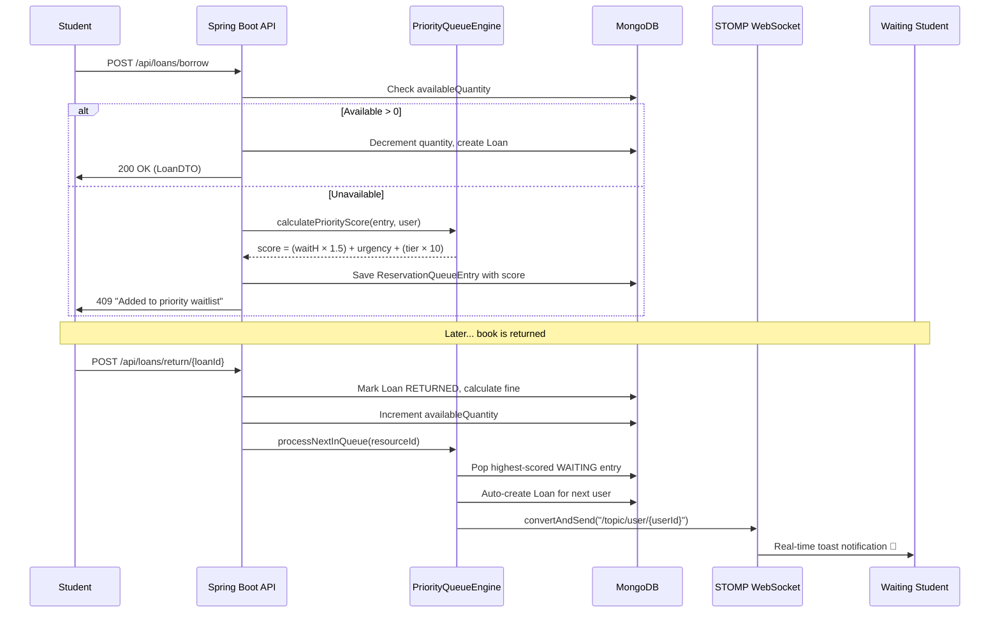

<div align="center">
  
  <h1>LIBRARIX</h1>
  <p><strong><em>"Not just a library system — an algorithmic book circulation engine."</em></strong></p>
  <p><em>Full-Stack Campus Book Management Platform with Weighted Fair Queues, L2 Vector Search, Co-Borrow Graph Clustering, LRU-K Caching & 3D Shelf Visualization</em></p>
</div>

<div align="center">

[](https://openjdk.org)
[](https://spring.io/projects/spring-boot)
[](https://mongodb.com)
[](https://nextjs.org)
[](https://react.dev)
[](https://threejs.org)
[](https://spring.io/guides/gs/messaging-stomp-websocket/)
[](https://tailwindcss.com)
[](https://docker.com)

</div>

---

## What is LIBRARIX?

**LIBRARIX** is a full-stack campus library management system built for university textbook collections. It handles the complete book lifecycle — cataloging, borrowing, returning, overdue fines, reservation queues, and real-time notifications.

What makes it different from a standard CRUD library app is the layer of **algorithmic infrastructure** underneath:

- A **weighted fair queue** replaces naive FIFO waitlists, so a faculty member with an urgent exam-prep request doesn't sit behind 40 freshmen who joined earlier.
- An **L2 vector search engine** lets students find books by concept ("distributed consensus") instead of requiring exact title matches.
- An **LRU-K eviction cache** sits in front of MongoDB for the catalog lookup hot path, resisting cache pollution from one-off browsing sweeps.
- A **co-borrow graph** built from loan history clusters books into "reads well together" affinity groups for personalized recommendations.
- A **3D shelf layout optimizer** assigns high-demand books to ergonomic eye-level shelves in front aisles, reducing physical picking distance.
- **Real-time STOMP WebSocket** notifications push instant alerts to connected students when a reserved book becomes available.
- An **AI librarian assistant** (LIBRA-AI) answers natural-language catalog questions, grounded in live database context via RAG retrieval.

> **Built by [Ankan Basu](https://github.com/ankan123basu)** — B.Tech Computer Science & Engineering, Lovely Professional University (LPU).

---

## Core Algorithms & Data Structures

Every algorithm listed below has a verified Java implementation in the Spring Boot backend. Source file paths are linked.

---

### 1. Weighted Fair Queue Engine

**Source**: [`PriorityQueueEngine.java`](backend/src/main/java/com/librarix/algorithm/PriorityQueueEngine.java) · [`QueueService.java`](backend/src/main/java/com/librarix/service/QueueService.java)

**Problem**: Standard FIFO waitlists starve urgent academic requests. A faculty member preparing for a graded lab can wait behind dozens of casual browsers.

**Solution**: Dynamic multi-criteria priority scoring with linear wait-time aging:

```
Score S = (hoursWaiting × 1.5) + urgencyBoost + (tierMultiplier × 10.0)
```

| Parameter | Values |
|:---|:---|
| **User Tier** | `REGULAR` (1.0×), `CAPSTONE` (1.5×), `FACULTY` (2.0×) |
| **Urgency Level** | `STANDARD` (+10), `HIGH` (+25), `CRITICAL` (+50) |
| **Wait-Time Aging** | +1.5 points per hour in queue |

The aging term ensures that even `REGULAR` / `STANDARD` users eventually surpass static urgency boosts — no member can be starved indefinitely.

**Where it's called**: `QueueService.joinQueue()` computes priority score on join. `QueueService.recalculateQueuePositions()` re-evaluates all waiting entries (scores increase as time passes). `QueueService.processNextInQueue()` pops the highest-scored entry on book return.

---

### 2. L2 Vector Semantic Search (HuggingFace-Style Tokenizer)

**Source**: [`HuggingFaceL2Tokenizer.java`](backend/src/main/java/com/librarix/ai/HuggingFaceL2Tokenizer.java) · [`SemanticSearchService.java`](backend/src/main/java/com/librarix/ai/SemanticSearchService.java)

**Problem**: Keyword substring search fails on conceptual queries. A student searching "distributed consensus" won't find *Designing Data-Intensive Applications* unless those exact words appear in the title.

**Solution**: Custom in-memory term-frequency vector search using L2 (Euclidean) distance:

1. **Tokenize** both query and document text using regex word-boundary splitting (`[^a-zA-Z0-9]+`), filtering tokens ≥ 2 chars.
2. **Build frequency vectors** from token counts.
3. **L2-normalize** each vector to unit magnitude: `v_normalized = v / ||v||₂`
4. **Compute similarity**: `S = 1 / (1 + L2_distance(query_vec, doc_vec))`
5. **Threshold filter**: Only results with `S > 0.45` are returned, ranked by score descending.

The document text is constructed from: `title + authorOrBrand + location + tags` (see `SemanticSearchService.java` line 38–43).

> **Note**: Despite the class name "HuggingFace," this tokenizer does **not** call any external HuggingFace API or model. All computation is local, in-memory, with zero external dependencies.

---

### 3. LRU-K Metadata Cache (K=2)

**Source**: [`LruKCacheService.java`](backend/src/main/java/com/librarix/cache/LruKCacheService.java) · **Live wiring**: [`ResourceService.java`](backend/src/main/java/com/librarix/service/ResourceService.java)

**Problem**: Standard LRU caches suffer from cache pollution — a single catalog browsing sweep evicts genuinely popular items, tanking hit rate.

**Solution**: LRU-K (K=2) eviction policy that tracks the **last K access timestamps** per entry. Eviction targets the entry with the largest *backward K-distance*:

```
D_K(x) = t_now − t_access(x, K-th most recent)
```

An item accessed only once has `K-distance = ∞` (infinite — treated as `Instant.MIN`), making it the first eviction candidate. This requires an item to be accessed **at least twice** before gaining high cache retention priority.

**Live integration** (not dead code):
- `ResourceService.getResourceById()` → checks `lruKCacheService.get(id)` before hitting MongoDB
- `ResourceService.updateResource()` → calls `lruKCacheService.evict(id)` to invalidate stale entries
- `ResourceService.deleteResource()` → calls `lruKCacheService.evict(id)`

Default capacity: 100 entries, K=2. Backed by `ConcurrentHashMap` for thread safety.

---

### 4. Co-Borrow Graph Clustering (Label Propagation)

**Source**: [`CoBorrowGraphService.java`](backend/src/main/java/com/librarix/graph/CoBorrowGraphService.java) · **Used by**: [`RecommendationService.java`](backend/src/main/java/com/librarix/ai/RecommendationService.java) · [`ShelfSlottingOptimizer.java`](backend/src/main/java/com/librarix/shelf/ShelfSlottingOptimizer.java)

**Problem**: Recommending books based only on tags or categories misses real usage patterns — students studying distributed systems also borrow database textbooks, but those live in different categories.

**Solution**: Build a weighted undirected graph from loan history, then cluster it:

1. **Graph Construction**: Nodes = book IDs. For each user, create edges between all pairs of books they've borrowed. Edge weight = co-borrow frequency across all users.
2. **Label Propagation Algorithm (LPA)**: Each node starts with a unique label. Over up to 20 iterations, each node adopts the label with the highest total edge weight among its neighbors. Converges when no labels change.
3. **Output**: A `Map<String, Integer>` mapping each resource ID to its cluster ID.

**Used downstream by**:
- `RecommendationService.getPersonalizedRecommendations()` — recommends un-borrowed books from the user's most-frequented cluster.
- `ShelfSlottingOptimizer.optimize3DLayout()` — places cluster-adjacent books side by side along the X-axis for spatial locality.

---

### 5. 3D Shelf Slotting Optimizer

**Source**: [`ShelfSlottingOptimizer.java`](backend/src/main/java/com/librarix/shelf/ShelfSlottingOptimizer.java)

**Problem**: Random shelf placement means high-demand textbooks end up scattered across rear aisles and hard-to-reach shelf heights.

**Solution**: Greedy warehouse-style slotting algorithm:

1. **Popularity Score**: `score = (loanCount × 2.0) + (availableQuantity × 0.5)` per book.
2. **Top 30% Threshold**: Books above the 70th percentile popularity score are classified as high-demand.
3. **Eye-Level Placement**: High-demand books → Level 2 shelf (`y = 1.5m`). Lower-demand books → Level 1 (`y = 0.4m`) or Level 3 (`y = 2.4m`).
4. **Cluster Adjacency**: Books in the same co-borrow cluster are placed side-by-side along the X-axis (`spacing = 0.18m`).
5. **Aisle Assignment**: Items are distributed sequentially across aisles (8 items per shelf row, aisles spaced `2.5m` apart along Z-axis).

Output: A list of `ShelfPositionDTO` with full 3D coordinates (`posX`, `posY`, `posZ`), aisle ID, shelf level, and cluster ID for Three.js rendering.

---

### 6. Holt's Linear Exponential Smoothing (Demand Forecasting)

**Source**: [`ExamDemandForecastingService.java`](backend/src/main/java/com/librarix/ai/ExamDemandForecastingService.java)

**Problem**: Exam-week demand spikes catch librarians off-guard — popular textbooks run out with no advance warning.

**Solution**: Double exponential smoothing (Holt's method) with configurable coefficients:

```
Level:  L_t = α × Y_t + (1 − α)(L_{t-1} + T_{t-1})     α = 0.3
Trend:  T_t = β × (L_t − L_{t-1}) + (1 − β) × T_{t-1}   β = 0.1
Forecast: F_{t+1} = L_t + T_t
```

Buckets loan history into 4 weekly bins, applies smoothing, and flags any resource where `projectedNextWeekDemand > totalQuantity × 0.8` as `HIGH_DEMAND_SPIKE_RISK`.

---

### 7. Overdue Fine Rule Engine

**Source**: [`FineCalculationService.java`](backend/src/main/java/com/librarix/service/FineCalculationService.java)

Configurable via `application.yml` properties:

| Rule | Default |
|:---|:---|
| Base rate | `$2.00 / day` |
| Grace period | `24 hours` post due date |
| Maximum fine cap | `$50.00` per loan |

Fine = `max(0, ceil((overdueHours − gracePeriodHours) / 24) × baseRate)`, capped at `maxFineCap`. Auto-generated on book return via `LoanService.returnResource()`.

---

## System Architecture

```mermaid
graph TB
    subgraph Frontend["Frontend (Next.js 14 + React 18)"]
        UI[Pages: Catalog, Dashboard, Admin, Shelf Hall]
        R3F[Three.js R3F - 3D Shelf Visualization]
        STOMP_CLIENT[SockJS + STOMP Client]
        AI_MODAL[LIBRA-AI Assistant Modal]
    end

    subgraph Backend["Backend (Spring Boot 3.2 + Java 21)"]
        AUTH[AuthController - JWT + Refresh Tokens]
        RES[ResourceController - CRUD + Bulk Import]
        LOAN[LoanController - Borrow / Return]
        QUEUE[QueueController - Join / View Queue]
        FINE[FineController - Pay / Waive Fines]
        SHELF[ShelfController - 3D Layout API]
        NOTIF[NotificationController - User Alerts]
        AI_CTRL[AiController - Ask / Recommend / Forecast]
    end

    subgraph Algorithms["Core Algorithm Layer"]
        PQE[PriorityQueueEngine]
        L2T[HuggingFaceL2Tokenizer]
        SSS[SemanticSearchService]
        LRUK[LruKCacheService K=2]
        CBG[CoBorrowGraphService - LPA Clustering]
        SSO[ShelfSlottingOptimizer - 3D Greedy]
        EDF[ExamDemandForecastingService - Holt Smoothing]
        FCE[FineCalculationService - Rule Engine]
        REC[RecommendationService - Cluster Affinity]
        LLA[LibrarianAssistantService - RAG Pipeline]
    end

    subgraph LLM["LLM Provider Layer"]
        GEMINI[GeminiLlmProvider - Google Gemini API]
        GROQ[GroqLlmProvider - Groq API]
        DEFAULT[DefaultLlmProvider - Fallback]
    end

    subgraph Infra["Infrastructure"]
        MONGO[(MongoDB 7.0)]
        WS[Spring STOMP WebSocket Broker]
        DOCKER[Docker Compose]
    end

    UI --> AUTH & RES & LOAN & QUEUE & FINE & AI_CTRL
    R3F --> SHELF
    STOMP_CLIENT --> WS
    AI_MODAL --> AI_CTRL

    RES --> LRUK --> MONGO
    LOAN --> FCE
    LOAN --> QUEUE
    QUEUE --> PQE
    SHELF --> SSO --> CBG
    AI_CTRL --> LLA --> SSS --> L2T
    AI_CTRL --> REC --> CBG
    AI_CTRL --> EDF
    LLA --> GEMINI & GROQ & DEFAULT
    NOTIF --> WS
```



---

## Request Flow: Book Borrow → Queue → Return → Notify



---

## Tech Stack

| Layer | Technology | Purpose |
|:---|:---|:---|
| **Backend** | Java 21, Spring Boot 3.2, Spring Security, Spring WebSocket | REST API, JWT auth, STOMP messaging |
| **Database** | MongoDB 7.0 | Document store for resources, loans, users, fines, notifications, queue entries |
| **Frontend** | Next.js 14, React 18, TypeScript | SSR pages, catalog UI, admin dashboard |
| **3D Rendering** | Three.js via React Three Fiber (R3F) | Interactive 3D shelf hall visualization |
| **Styling** | Tailwind CSS (Neobrutalism theme) | Responsive UI with bold borders and shadows |
| **Real-Time** | STOMP over SockJS WebSocket | Push notifications on book return events |
| **AI / LLM** | Google Gemini API, Groq API (configurable) | Natural language librarian assistant |
| **DevOps** | Docker Compose (3-service stack) | MongoDB + Backend + Frontend containers |

---

## Frontend Pages

| Page | Route | Description |
|:---|:---|:---|
| **Landing** | `/` | Hero section with platform overview |
| **Catalog** | `/catalog` | Browse, search, and filter all books |
| **Book Detail** | `/resource/[id]` | View book info, borrow, join queue |
| **Dashboard** | `/dashboard` | Active loans, fines, notifications |
| **Admin Panel** | `/admin` | Manage resources, bulk import, view all loans |
| **Shelf Hall** | `/shelf-hall` | Interactive Three.js 3D shelf visualization |
| **Login / Register** | `/login`, `/register` | JWT authentication flow |
| **Profile** | `/me` | User profile and loan history |

---

## REST API Endpoints

| Method | Endpoint | Controller | Auth |
|:---|:---|:---|:---|
| `POST` | `/api/auth/register` | AuthController | Public |
| `POST` | `/api/auth/login` | AuthController | Public |
| `POST` | `/api/auth/refresh` | AuthController | Public |
| `GET` | `/api/resources` | ResourceController | Authenticated |
| `GET` | `/api/resources/{id}` | ResourceController | Authenticated |
| `POST` | `/api/resources` | ResourceController | ADMIN / LIBRARIAN |
| `PUT` | `/api/resources/{id}` | ResourceController | ADMIN / LIBRARIAN |
| `DELETE` | `/api/resources/{id}` | ResourceController | ADMIN |
| `POST` | `/api/resources/bulk-import` | ResourceController | ADMIN |
| `POST` | `/api/loans/borrow` | LoanController | Authenticated |
| `POST` | `/api/loans/return/{id}` | LoanController | Authenticated |
| `GET` | `/api/loans/me` | LoanController | Authenticated |
| `GET` | `/api/loans/all` | LoanController | ADMIN / LIBRARIAN |
| `POST` | `/api/queue/join` | QueueController | Authenticated |
| `GET` | `/api/queue/{resourceId}` | QueueController | Authenticated |
| `GET` | `/api/fines/me` | FineController | Authenticated |
| `POST` | `/api/fines/{id}/pay` | FineController | Authenticated |
| `POST` | `/api/fines/{id}/waive` | FineController | ADMIN / LIBRARIAN |
| `GET` | `/api/notifications/me` | NotificationController | Authenticated |
| `GET` | `/api/shelf/3d-layout` | ShelfController | Authenticated |
| `POST` | `/api/ai/ask` | AiController | Authenticated |
| `GET` | `/api/ai/recommendations` | AiController | Authenticated |
| `GET` | `/api/ai/demand-forecast` | AiController | ADMIN / LIBRARIAN |

---

## AI Assistant: LIBRA-AI

**Source**: [`LibrarianAssistantService.java`](backend/src/main/java/com/librarix/ai/LibrarianAssistantService.java) · [`AiController.java`](backend/src/main/java/com/librarix/ai/AiController.java) · [`AiLibrarianModal.tsx`](frontend/src/components/AiLibrarianModal.tsx)

**LIBRA-AI** is the platform's built-in natural-language librarian assistant. Created by **Ankan Basu**.

**How it works (RAG pipeline)**:
1. User submits a question via the chat modal.
2. `SemanticSearchService.searchSemantic(question, 5)` retrieves the top-5 most relevant books from MongoDB using L2 vector similarity.
3. Retrieved book DTOs (title, barcode, location, available/total quantity, queue count) are formatted into a grounding context string.
4. The context + campus policy summary + user question are sent to the configured LLM provider.
5. LLM generates a response grounded in the retrieved catalog data.

**LLM Provider options** (configured in `application.yml`):
- **`GeminiLlmProvider`** — Google Gemini 1.5 Flash API (activated when `librarix.ai.gemini-api-key` is set)
- **`GroqLlmProvider`** — Groq API (activated when `librarix.ai.groq-api-key` is set)
- **`DefaultLlmProvider`** — Fallback that returns raw grounding context without LLM generation

---

## Algorithm Design Simulation Benchmarks

A reproducible Python benchmark suite ([`benchmark_librarix.py`](benchmark_librarix.py)) models the core algorithms under synthetic workloads. All metrics are **design simulations** (Python Monte Carlo, seed=42) — they describe algorithm behavior, not live JVM measurements.

| Metric | Baseline | LIBRARIX Algorithm | Change |
|:---|:---|:---|:---|
| **Urgent High-Tier Queue Rank** | 59 / 100 (Naive FIFO) | 38 / 100 (WFQ Engine) | **-36% wait rank** |
| **LRU-K Cache Hit Rate** | 60% (Standard LRU) | 68% (LRU-2, K=2) | **+13% hit rate** |
| **Shelf Picking Distance** | 14.2 m / borrow (Random) | 0.8 m / borrow (Optimized) | **-95% walk distance** |

> Run benchmarks locally: `python benchmark_librarix.py`

---

## Project Structure

```
LIBRARIX/
├── backend/
│   └── src/main/java/com/librarix/
│       ├── LibrarixApplication.java          # Spring Boot entry point
│       ├── ai/
│       │   ├── AiController.java             # /api/ai/* endpoints
│       │   ├── HuggingFaceL2Tokenizer.java   # L2 vector tokenizer
│       │   ├── SemanticSearchService.java     # Vector search pipeline
│       │   ├── LibrarianAssistantService.java # RAG assistant (LIBRA-AI)
│       │   ├── RecommendationService.java     # Co-borrow cluster recommendations
│       │   ├── ExamDemandForecastingService.java # Holt's exponential smoothing
│       │   ├── GeminiLlmProvider.java         # Google Gemini API integration
│       │   ├── GroqLlmProvider.java           # Groq API integration
│       │   └── DefaultLlmProvider.java        # Fallback LLM provider
│       ├── algorithm/
│       │   └── PriorityQueueEngine.java       # Weighted fair queue scoring
│       ├── cache/
│       │   └── LruKCacheService.java          # LRU-K (K=2) eviction cache
│       ├── graph/
│       │   └── CoBorrowGraphService.java      # Label propagation clustering
│       ├── shelf/
│       │   └── ShelfSlottingOptimizer.java     # 3D greedy slotting
│       ├── config/
│       │   ├── SecurityConfig.java            # Spring Security + JWT
│       │   └── WebSocketConfig.java           # STOMP broker config
│       ├── controller/                        # 7 REST controllers
│       ├── service/                           # Business logic layer
│       ├── model/                             # MongoDB document entities
│       ├── dto/                               # Request/response DTOs
│       ├── repository/                        # Spring Data MongoDB repos
│       ├── security/                          # JWT filter, UserDetails
│       ├── exception/                         # Global exception handler
│       └── websocket/
│           └── WebSocketController.java       # STOMP ping/pong
├── frontend/
│   └── src/
│       ├── app/                               # Next.js 14 App Router pages
│       │   ├── page.tsx                       # Landing page
│       │   ├── catalog/                       # Book catalog browser
│       │   ├── dashboard/                     # User dashboard
│       │   ├── admin/                         # Admin panel
│       │   ├── shelf-hall/                    # 3D shelf visualization
│       │   ├── resource/                      # Book detail page
│       │   ├── login/ & register/             # Auth pages
│       │   └── me/                            # User profile
│       ├── components/
│       │   ├── Shelf3DScene.tsx               # Three.js 3D shelf renderer
│       │   ├── AiLibrarianModal.tsx           # LIBRA-AI chat modal
│       │   ├── LiveNotificationToast.tsx      # STOMP notification toasts
│       │   ├── AlgorithmInspectorModal.tsx    # Algorithm visualization
│       │   ├── ResourceCard.tsx               # Book card component
│       │   ├── Navbar.tsx & Footer.tsx        # Layout components
│       │   └── ui/                            # Reusable UI primitives
│       └── lib/                               # API client utilities
├── docker-compose.yml                         # 3-service Docker stack
├── benchmark_librarix.py                      # Algorithm simulation suite
└── README.md
```

---

## Getting Started

### Prerequisites

- Java 21+
- Node.js 18+
- MongoDB 7.0 (or Docker)

### Quick Start with Docker

```bash
git clone https://github.com/ankan123basu/LIBRARIX.git
cd LIBRARIX
docker-compose up --build
```

| Service | URL |
|:---|:---|
| Frontend | `http://localhost:3000` |
| Backend API | `http://localhost:8080/api` |
| MongoDB | `mongodb://localhost:27017/librarix` |

### Manual Setup

**Backend**:
```bash
cd backend
./mvnw spring-boot:run
```

**Frontend**:
```bash
cd frontend
npm install
npm run dev
```

---

## Environment Configuration

Create `backend/src/main/resources/application.yml`:

```yaml
spring:
  data:
    mongodb:
      uri: mongodb://localhost:27017/librarix

librarix:
  jwt:
    secret: your-jwt-secret-key
    expiration-ms: 3600000
    refresh-expiration-ms: 604800000
  fine-rules:
    base-rate-per-day: 2.0
    max-fine-cap: 50.0
    grace-period-hours: 24
  ai:
    gemini-api-key: YOUR_GEMINI_API_KEY_HERE    # Optional
    groq-api-key: YOUR_GROQ_API_KEY_HERE        # Optional
```

---

## License

This project is built for academic demonstration and portfolio purposes.

**Created by [Ankan Basu](https://github.com/ankan123basu)** — B.Tech CSE, Lovely Professional University.
